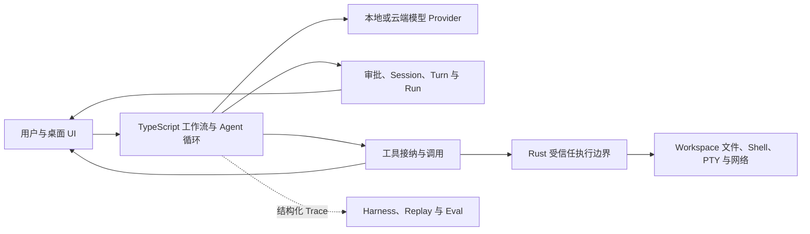

<div align="center">
  
  <h1>MAIN</h1>
  <p><strong>面向本地模型与多模型生态的开源桌面 Agent 工作台</strong></p>
  <p>在一个可审阅的桌面界面中完成理解、规划、执行、审批与验证，也为开发自己的本地智能体工具提供可运行的参考实现。</p>

  <p>
    <a href="https://github.com/MSTUDIOHUB/MAIN/actions/workflows/ci.yml"></a>
    <a href="LICENSE"></a>
    <a href="https://github.com/MSTUDIOHUB/MAIN-Releases/releases/latest"></a>
    
    
  </p>
</div>


> [!IMPORTANT]
> MAIN 正在快速迭代，当前适合开发者试用和共同完善。涉及文件写入、Shell、网络或外部程序的操作仍需人工审查。MAIN 的受信任执行边界不是操作系统级沙箱。

## MAIN 是什么

MAIN 是一个基于 Tauri 2、React、TypeScript 与 Rust 构建的本地优先桌面智能体。它既是可以直接使用的 AI 工作台，也是一个用于研究和二次开发本地 Agent 的完整工程样本。

与只提供聊天窗口的应用不同，MAIN 把真实任务所需的关键环节放进同一条可观察工作流：

- 连接本地模型：LM Studio、Ollama、OMLX。
- 连接云端模型：OpenAI Compatible、OpenAI Responses API、Anthropic、Gemini 等协议。
- 在 Chat、Plan、Fast 三种工作方式之间选择分析、先审后做或快速执行。
- 使用文件、终端、PTY、浏览器验证、知识库和 MCP 工具完成任务。
- 在写文件、执行命令和高风险操作前显示审批与 Diff。
- 持久化 Workspace、Session、Turn 和 Run，支持暂停、恢复和结构化结论。
- 用 Trace、Replay、Golden 与测试夹具验证 Agent 行为，而不只验证最终文本。
- 通过 Skills、协议包、Hooks 和工作区规则扩展专用工作流。

MAIN 已在多个版本中使用 Codex 参与架构重构、测试补强和文档维护；所有合并与发布仍由项目维护者负责审查。

## 为什么值得作为本地 Agent 的起点

如果你也想开发自己的智能体工具，可以直接运行 MAIN，再从下列边界逐步替换，而不必从一个聊天框重新搭建全部基础设施：

| 你想改什么 | 主要入口 |
| --- | --- |
| 接入新的模型或本地推理服务 | `src/lib/providerCompatibility.ts`、`src/lib/modelDiscovery.ts`、`src/lib/cloudProtocol.ts` |
| 修改 Agent 循环、计划与恢复策略 | `src/lib/orchestrator/`、`src/lib/planLifecycle.ts`、`src/store/submitAsyncWorkflowRun.ts` |
| 增加或约束工具 | `src/lib/toolSchemas.ts`、`src/lib/runtimeTools.ts`、`src/lib/toolExecutor.ts` |
| 加强文件、Shell、网络与进程安全 | `src-tauri/src/trusted_execution.rs`、`src-tauri/src/network_guard.rs` |
| 定制桌面交互、Diff、计划和终端 | `src/components/`、`src/store/` |
| 建立可回放的 Agent 评测 | `src-tauri/src/harness/`、`src-tauri/src/runtime/`、`benchmark/` |
| 扩展技能或行业工作流 | `.MAIN/`、`src/gameStudioPack/`、MCP 配置 |

## 架构概览



TypeScript 决定“做什么”，Rust 对已经接入统一边界的本机操作做最终校验。Harness 用于回放、评测与一致性验证，不是第二套生产 Agent 循环。详细设计见[架构文档](docs/ARCHITECTURE.md)。

## 快速开始

### 1. 准备环境

- Node.js 20 或更高版本
- Rust stable 工具链
- 当前系统对应的 [Tauri 2 前置依赖](https://v2.tauri.app/start/prerequisites/)
- 一个正在运行的本地模型服务，或可用的云端模型 API

官方发布包目前面向 macOS 和 Windows；其他平台可以从源码尝试构建，但尚未作为正式发布目标持续验收。

### 2. 启动开发版

```bash
git clone https://github.com/MSTUDIOHUB/MAIN.git
cd MAIN
npm ci
npm run tauri dev
```

首次启动后，在系统设置中配置模型：

1. 本地模型选择 LM Studio、Ollama 或 OMLX，并填写 Endpoint。
2. 云端模型选择对应协议，填写 Endpoint、API Key 和模型名。
3. 添加一个测试工作区，先发送只读任务确认模型和工具链正常。

不要把真实 API Key 写入仓库、Issue、日志或截图。

`package.json` 中的 `private: true` 仅用于防止把桌面应用误发布到 npm，不代表源码仓库是私有项目。

### 3. 运行基础验证

```bash
npm run lint
npm run build
npm run test:workflow-assets
```

桌面端或 Rust 边界变更还应根据范围运行：

```bash
cargo test --manifest-path src-tauri/Cargo.toml
npm run test:e2e
```

## 项目结构

```text
MAIN/
├── src/                    # React UI、状态、Provider、工具与生产 Agent 工作流
├── src-tauri/              # Rust/Tauri 宿主、受信任执行、持久化与回放基础设施
├── tests/                  # Node 与 Playwright 回归测试
├── benchmark/              # Agent Trace、Replay 与评测夹具
├── docs/                   # 架构规范、用户手册与发布说明
├── .MAIN/                  # 项目规则、模板、Hooks 和可扩展工作区资产
├── src/gameStudioPack/     # Game Studio 协议包与工作流资产
├── cloud-gateway/          # 可选的云端协议适配示例
└── scripts/                # 构建、验证和发布脚本
```

## 开发与打包

```bash
# 前端开发服务器
npm run dev

# Tauri 桌面开发
npm run tauri dev

# 本机桌面构建
npm run build:desktop

# macOS 未签名验证包
npm run build:mac:unsigned

# Windows 11 x64 安装包（在 Windows 环境执行）
npm run build:windows
```

签名、公证、Updater 密钥和跨仓库 Release 属于发布者运维边界，详见[桌面打包与公开发布指南](docs/Release_Guide_ZH.md)。普通贡献者不需要任何发布密钥。

## 文档

- [快速开始](docs/main-manual/quickstart.md)
- [本地模型](docs/main-manual/local-models.md) / [云端模型](docs/main-manual/cloud-models.md)
- [Chat / Plan / Fast](docs/main-manual/run-modes.md)
- [权限与审批](docs/main-manual/permissions-and-approval.md)
- [MCP 服务器](docs/main-manual/mcp.md)
- [架构与唯一所有权](docs/ARCHITECTURE.md)
- [Run / Turn 生命周期](docs/RUNTIME_LIFECYCLE.md)
- [Session 持久化](docs/SESSION_PERSISTENCE.md)
- [受信任执行边界](docs/TRUSTED_EXECUTION.md)
- [测试、Trace 与 Replay](docs/TESTING_AND_REPLAY.md)

## 参与贡献

Bug、文档、Provider 兼容、工具协议、测试夹具和本地模型适配都很欢迎。开始前请阅读 [CONTRIBUTING.md](CONTRIBUTING.md) 与 [CODE_OF_CONDUCT.md](CODE_OF_CONDUCT.md)。

使用 AI 或 Codex 辅助贡献是允许的，但提交者必须理解改动、检查敏感信息、运行相关验证，并对最终代码负责。

安全问题请不要创建公开 Issue，按 [SECURITY.md](SECURITY.md) 中的私密渠道报告。

## 下载

- [最新 macOS / Windows 版本](https://github.com/MSTUDIOHUB/MAIN-Releases/releases/latest)
- [全部发布记录](https://github.com/MSTUDIOHUB/MAIN-Releases/releases)

## 许可证

MAIN 采用 [Apache License 2.0](LICENSE) 开源。你可以使用、修改和分发本项目，包括用于商业项目，但需要保留许可证和必要的版权声明。

MAIN 是独立的开源项目，不是 OpenAI 官方产品，也不代表 OpenAI。
