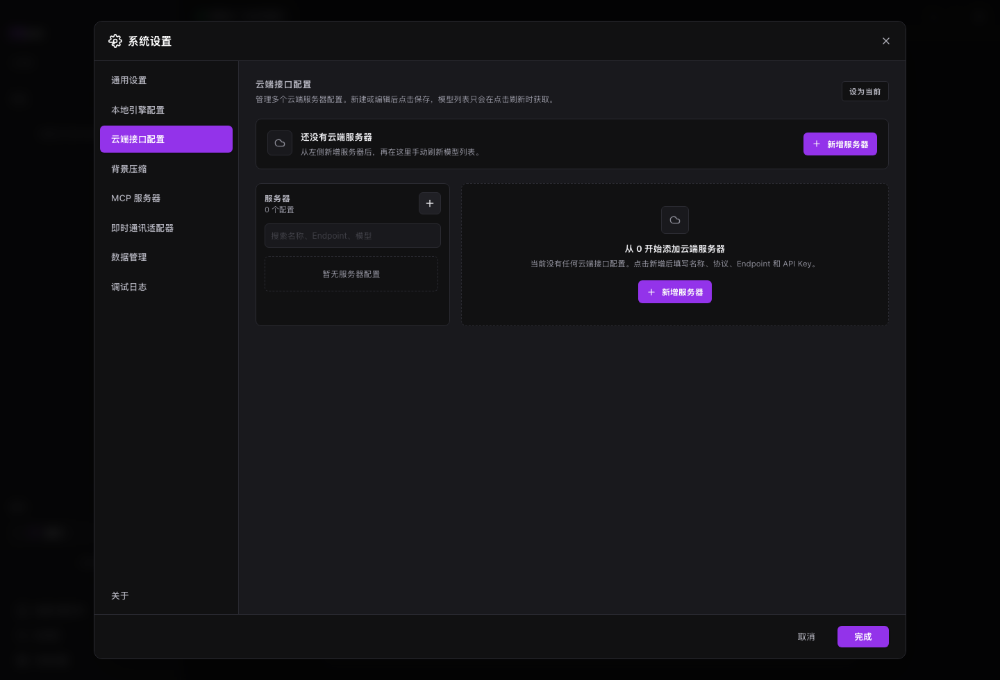

# 云端模型

云端模型适合更强推理、更长上下文和稳定工具调用。MAIN 支持 OpenAI Compatible、Anthropic、Gemini 和 Responses API。

## 适用场景

- 复杂开发、研究或长文档任务。
- 使用聚合网关或公司模型服务。
- 给本地模型准备备用方案。

## 前置条件

- 准备 API Key。
- 知道服务 Endpoint、协议和模型名。
- 网络可以访问对应服务。

## 步骤

1. 打开系统设置。
2. 进入云端接口配置。
3. 点击新增服务器。
4. 选择协议，填写 Endpoint、API Key 和模型名。
5. 测试连接。
6. 设为当前模型并保存。

## 结果确认

- 服务器列表出现新配置。
- 连接测试成功。
- 顶部模型状态切换到云端模型。

## 常见问题

**聚合网关选哪个协议？**  
多数选择 OpenAI Compatible。

**Responses API 什么时候用？**  
服务明确支持 OpenAI Responses API 时再用。

**API Key 会写进文档吗？**  
不会。手册只说明配置方式，不记录真实密钥。

## 下一步

- 阅读 [本地模型](local-models.md)，准备备用模型。
- 阅读 [工具参考](tools-reference.md)，理解工具协议。
- 阅读 [故障排查](troubleshooting.md)，处理连接失败。
