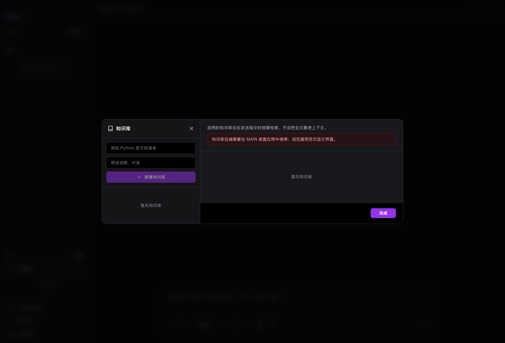

# 知识库

知识库把文件、网页或资料集合变成可检索上下文。长期复用的项目资料适合放在这里。

## 适用场景

- 项目文档很多。
- 不想每次重复粘贴背景。
- 希望 MAIN 按需检索资料。

## 前置条件

- 准备要导入的文件、网页或文本。
- 大资料建议按主题拆分。

## 步骤

1. 打开知识库。
2. 新建知识库。
3. 导入文件、网页或文本。
4. 等待索引完成。
5. 在会话中启用知识库。
6. 用一个具体问题测试检索结果。

## 结果确认

- 列表中出现知识库。
- 导入资料进入可检索状态。
- 测试搜索能返回相关片段。

## 常见问题

**知识库会把全文塞进上下文吗？**  
不会。MAIN 只按需取相关片段。

**导入失败怎么办？**  
检查文件格式、网页访问和本地索引状态。

**什么时候不用知识库？**  
一次性小文件直接附件或放在工作区即可。

## 下一步

- 阅读 [上下文与记忆](context-and-memory.md)，理解知识库如何进入上下文。
- 阅读 [研究分析场景](main-modes.md)，选择资料分析入口。
- 阅读 [故障排查](troubleshooting.md)，处理导入或检索问题。
