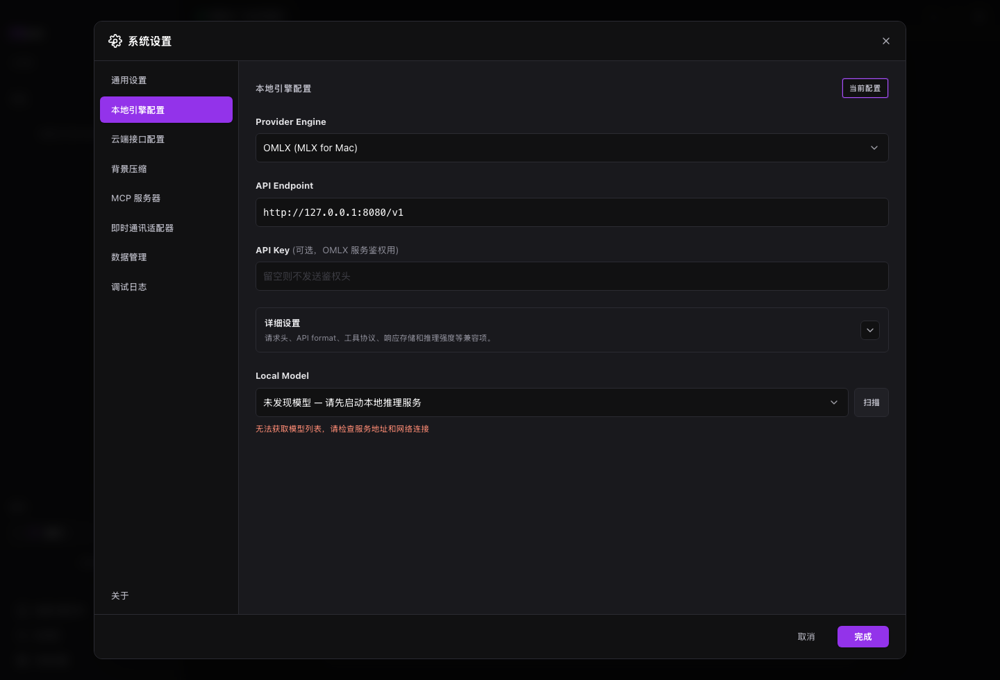

# 本地模型

本地模型适合隐私敏感、离线试验或低成本使用。MAIN 支持 LM Studio、Ollama 和 OMLX。

## 适用场景

- 项目资料希望留在本机。
- 已经启动 LM Studio、Ollama 或 OMLX。
- 需要云端不可用时的备用模型。

## 前置条件

- 本地模型服务已启动。
- 服务里已有可用模型。
- 知道服务 Endpoint。

## 步骤

1. 打开系统设置。
2. 进入本地引擎配置。
3. 选择 Provider。
4. 填写 Endpoint。
5. 点击扫描并选择模型。
6. 保存后回到主界面。

## 结果确认

- 模型列表能显示可用模型。
- 顶部模型状态更新。
- 发送简单任务后能收到回复。

## 常见问题

**扫描不到模型怎么办？**  
确认服务运行，再检查 Endpoint 和端口。

**本地模型适合大型代码任务吗？**  
取决于模型能力。复杂任务建议用 Plan 模式拆小。

**可以同时保留云端配置吗？**  
可以。你可以按任务切换模型。

## 下一步

- 阅读 [上下文与记忆](context-and-memory.md)，调整上下文。
- 阅读 [云端模型](cloud-models.md)，配置备用云端模型。
- 阅读 [故障排查](troubleshooting.md)，处理连接问题。
