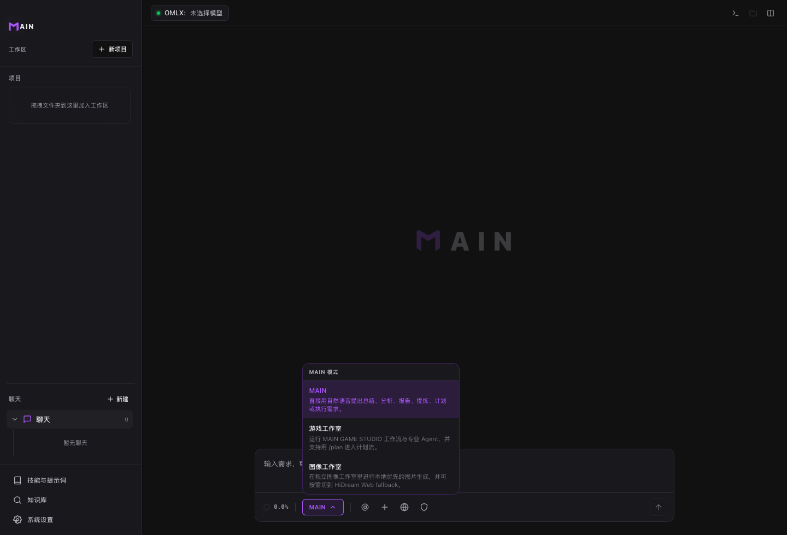

# MAIN 场景

底部 `MAIN` 菜单用于切换工作场景。场景会影响提示词、工具倾向和任务组织方式。

## 适用场景

- 普通问答、总结、研究和代码任务。
- 游戏项目需要 Game Studio 工作流。
- 图片生成任务需要图像工作室。

## 前置条件

- 已打开 MAIN。
- 已创建全局聊天或工作区会话。

## 场景说明

- `MAIN`：通用协作、研究分析、代码任务和文档整理。
- `游戏工作室`：游戏概念、GDD、引擎配置、Agent 和 slash 命令。
- `图像工作室`：图片生成、本地图片服务和 HiDream Web fallback。

## 步骤

1. 在输入框下方点击 `MAIN`。
2. 选择最接近当前目标的场景。
3. 输入任务。
4. 目标变化明显时，先切换场景再继续。

## 结果确认

- 当前场景在菜单中高亮。
- Game Studio 会出现游戏工作流入口。
- 图像工作室会进入图片生成相关流程。

## 常见问题

**MAIN 场景和 Chat / Plan / Fast 是一回事吗？**  
不是。场景说明做什么；Chat / Plan / Fast 说明用什么节奏执行。

**普通写代码要切 Game Studio 吗？**  
不需要。普通开发留在 MAIN 即可。

**不确定选哪个怎么办？**  
先用 MAIN 描述目标，再根据 MAIN 的建议切换。

## 下一步

- 阅读 [Chat / Plan / Fast](run-modes.md)，选择执行方式。
- 阅读 [Game Studio](game-studio.md)，了解游戏工作室专属能力。
- 阅读 [图像工作室](image-studio.md)，了解图片生成入口。
