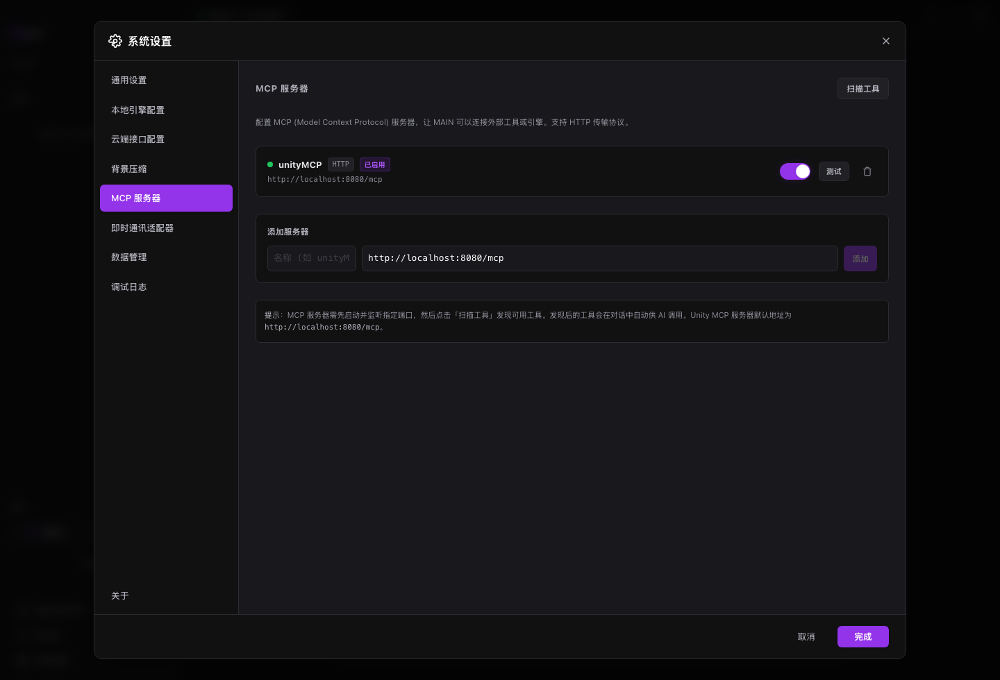

# MCP 服务器

MCP 让 MAIN 连接外部工具服务器，例如 Unity、内部系统或自定义工具。

## 适用场景

- 连接 Unity 或游戏引擎工具。
- 接入内部系统、数据库或自定义工具。
- 诊断 MCP 连接状态。

## 前置条件

- MCP Server 已启动。
- 知道地址和协议。
- Unity MCP 默认地址通常是 `http://localhost:8080/mcp`。

## 步骤

1. 打开系统设置。
2. 进入 MCP 服务器。
3. 添加或确认服务器地址。
4. 测试连接。
5. 点击扫描工具。
6. 在会话中让 MAIN 使用对应工具。

## 结果确认

- 服务器显示已启用。
- 工具扫描能发现工具。
- 对话中的工具请求会标明 MCP 来源。

## 常见问题

**MCP 连接失败怎么办？**  
确认服务器启动、端口可访问。

**Unity MCP 默认地址是什么？**  
常见默认地址是 `http://localhost:8080/mcp`。

**可以同时配置多个 MCP 吗？**  
可以。建议只启用当前任务需要的服务器。

## 下一步

- 阅读 [Game Studio](game-studio.md)，了解 Unity 和游戏工作流。
- 阅读 [工具参考](tools-reference.md)，区分内置工具和 MCP 工具。
- 阅读 [故障排查](troubleshooting.md)，处理 MCP 错误。
