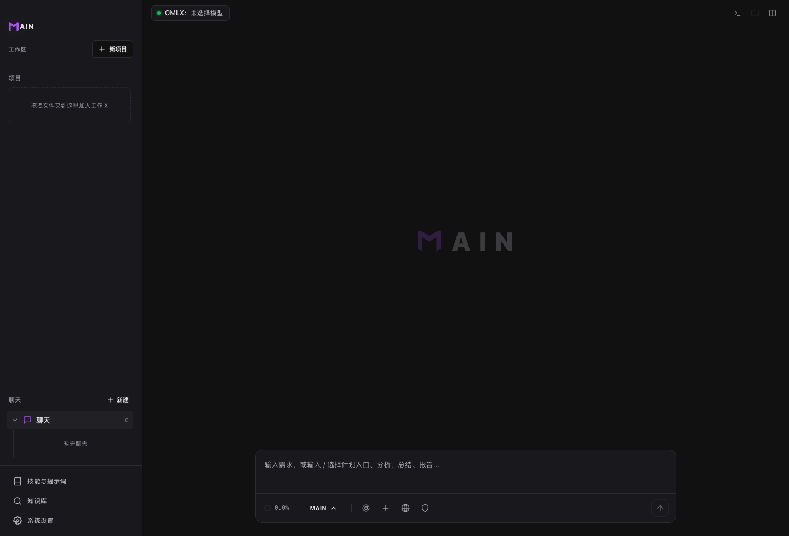

# MAIN 概览

MAIN 是一个桌面 AI 工作台。它把模型、工作区、会话、工具执行、审批和结果总结放在同一个窗口里。

## 适用场景

- 阅读项目结构、代码和文档。
- 修 bug、实现功能、重构并验证。
- 先看计划或 Diff，再批准写入。
- 使用知识库、MCP、图像工作室或游戏工作室。

## 前置条件

- 已安装 MAIN。
- 准备本地模型或云端 API。
- 准备一个可以试用的项目文件夹。

## 基本流程

1. 连接模型。
2. 添加工作区。
3. 在底部输入任务。
4. 审查计划、命令或 Diff。
5. 查看总结和验证结果。

## 结果确认

- 顶部显示当前模型。
- 左侧显示工作区和会话。
- 对话区能看到工具记录和总结。
- 有改动时，可以继续查看 Diff 或 Git。

## 常见问题

**必须使用云端模型吗？**  
不必须。MAIN 支持 LM Studio、Ollama、OMLX，也支持云端接口。

**MAIN 会直接改文件吗？**  
敏感操作会进入审批流程，除非你明确开启自动批准。

**非代码任务能用吗？**  
可以。资料整理、研究分析、文案和图片任务都可以在 MAIN 中完成。

## 下一步

- 阅读 [快速开始](quickstart.md)，完成第一次模型连接和任务发送。
- 阅读 [MAIN 场景](main-modes.md)，选择合适入口。
- 阅读 [权限与审批](permissions-and-approval.md)，理解写入保护。
