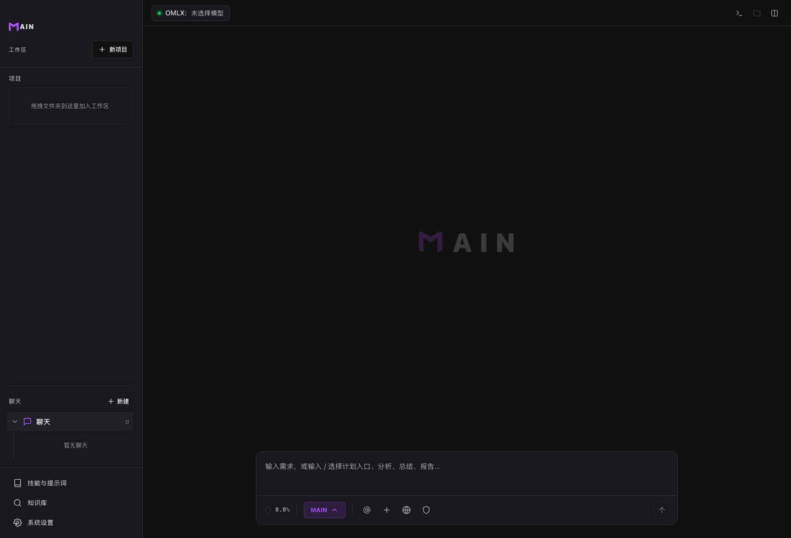

# Chat / Plan / Fast

工作方式决定 MAIN 的执行节奏：直接聊、先计划，或快速处理小任务。

## 怎么选

- `Chat`：提问、讨论、总结、只读分析。
- `Plan`：多文件修改、架构调整、风险较高的开发任务。
- `Fast`：目标明确、影响范围小、可以快速执行的任务。

## 前置条件

- 已选择模型。
- 已打开工作区，或使用全局聊天。

## 步骤

1. 在输入区选择合适工作方式。
2. 描述目标、范围和限制。
3. Plan 模式下先审查计划。
4. 批准后再让 MAIN 执行。
5. 执行结束后查看总结、Diff 和验证结果。

## 结果确认

- Chat 更偏讨论和分析。
- Plan 会先给出可审阅计划。
- Fast 会减少往返，适合小改动。

## 常见问题

**什么时候必须用 Plan？**  
涉及多文件、架构、数据迁移、发布或高风险命令时建议用 Plan。

**Fast 安全吗？**  
Fast 仍受审批保护，但不适合模糊或高风险任务。

**可以中途切换吗？**  
可以。任务变复杂时，直接要求 MAIN 先整理计划。

## 下一步

- 阅读 [计划模式](plan-mode.md)，了解计划审批。
- 阅读 [权限与审批](permissions-and-approval.md)，理解写入与命令保护。
- 阅读 [代码工作流](coding-workflows.md)，选择开发节奏。
