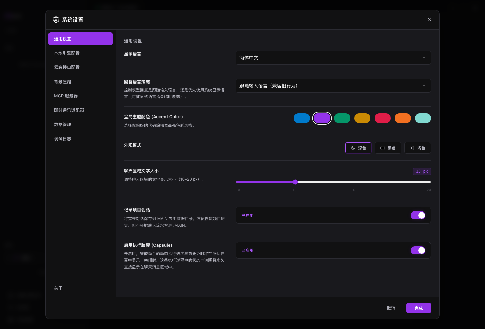

# 设置参考

系统设置集中管理语言、主题、模型、MCP、飞书适配器、数据和日志。

## 常用入口

- `通用设置`：语言、主题、字号、项目会话记录。
- `本地引擎配置`：LM Studio、Ollama、OMLX。
- `云端接口配置`：OpenAI Compatible、Anthropic、Gemini、Responses API。
- `背景压缩`：上下文压缩和摘要策略。
- `MCP 服务器`：外部工具服务器。
- `即时通讯适配器`：飞书远程控制。
- `数据管理`：缓存、会话和本地数据。
- `调试日志`：连接和执行问题排查。

## 使用方式

1. 打开左侧“系统设置”。
2. 选择左侧 tab。
3. 修改配置。
4. 点击完成或保存。
5. 回到主界面验证模型、工具或主题是否生效。

## 结果确认

- 顶部模型状态或主题样式已更新。
- MCP、飞书等服务显示对应状态。
- 调试日志能看到最近连接或执行记录。

## 常见问题

**改完设置没有生效怎么办？**  
先点击完成，再回到主界面重试；模型配置可重新扫描或测试连接。

**浅色、深色和黑色有什么区别？**  
浅色适合文档阅读，深色适合日常工作，黑色适合低亮度环境。

**设置会同步到云端吗？**  
默认是本地配置。不要把 API Key 写进公开文档或截图。

## 下一步

- 阅读 [本地模型](local-models.md) 或 [云端模型](cloud-models.md)，完成模型配置。
- 阅读 [MCP 服务器](mcp.md)，配置外部工具。
- 阅读 [故障排查](troubleshooting.md)，按症状定位问题。
