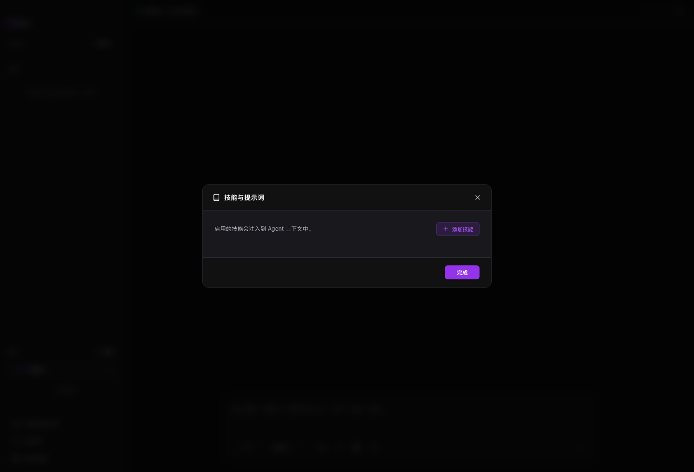

# 技能与协议包

技能与提示词用于把常用规则、模板和工具说明加入 MAIN 上下文。

## 适用场景

- 团队有固定规范。
- 某类任务经常重复。
- 需要导入 Game Studio 等协议包。

## 前置条件

- 已准备技能说明或协议包文件。
- 工具型技能需要对应 MCP 或本地服务。

## 步骤

1. 打开技能与提示词。
2. 新建或导入技能。
3. 填写名称、说明和提示词。
4. 需要工具时，确认 MCP 或本地服务已启用。
5. 在会话中启用并测试。

## 结果确认

- 技能出现在列表中。
- 启用后，MAIN 会按规则回复或行动。
- 工具型技能能触发对应工具。

## 常见问题

**技能和普通提示词有什么区别？**  
技能适合长期复用，也可以绑定工具说明。

**技能越多越好吗？**  
不是。只启用当前任务需要的技能。

**协议包是什么？**  
协议包是一组技能、模板、规则和命令。

## 下一步

- 阅读 [Game Studio](game-studio.md)，查看协议包例子。
- 阅读 [MCP 服务器](mcp.md)，为工具能力提供外部执行端。
- 阅读 [设置参考](settings-reference.md)，找到 Skills 入口。
