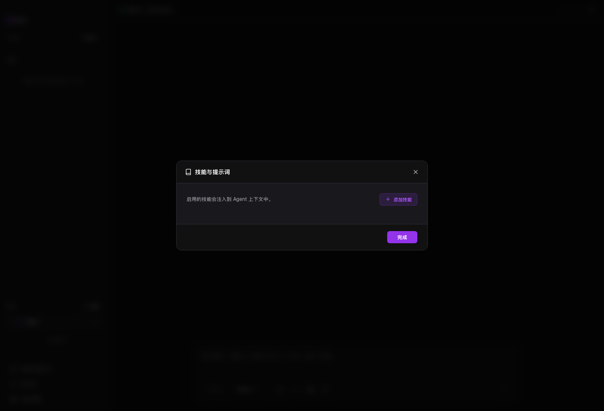

# 技能与协议包

MAIN 的 Agent Skill 是一组可复用工作流说明。启用后，Runtime 在 Turn 入场时冻结 Skill 目录；首个模型请求只看到名称和描述，匹配后才通过只读 `load_skill` 加载完整 `SKILL.md`。Skill 不会绕过文件、Shell、网络或 MCP 的既有权限。

## 适用场景

- 团队有固定规范。
- 某类任务经常重复。
- 需要把可复用说明和支持文件作为协议包导入工作区。

## 前置条件

- 已准备 Skill 名称、用途描述和 Markdown 说明，或包含 `SKILL.md` 的 ZIP。
- 如果 Skill 需要外部能力，对应能力必须已经注册为内置工具、MCP 或插件工具。

## 步骤

1. 打开技能与提示词。
2. 新建或导入技能。
3. 填写名称、准确的用途描述和 `SKILL.md` 内容。
4. 决定是否开启“允许模型自动匹配”。关闭后只能手动启用。
5. 保存并启用；不需要重启，下一次 Turn 会读取新的目录版本。
6. 可在消息中写 `$技能名` 或 `@技能名`，确定性地启用一个 Skill。

项目也可以直接提交 `.agents/skills/<skill-name>/SKILL.md`；个人 Skill 可放在 `$HOME/.agents/skills/`，并支持把 Skill 目录符号链接到该位置。可选的 `agents/openai.yaml` 支持 `allow_implicit_invocation: false`，用于只允许手动启用的 Skill。`references/`、`scripts/` 和 `assets/` 等支持文件只会列出路径，Agent 仍需通过普通受权工具按需读取或执行。

## 结果确认

- Skill 出现在面板，或位于项目 `.agents/skills/` 目录。
- 启用后，下一次 Execute、Plan 或 Goal Turn 的模型请求包含 Skill 名称和描述，但不包含未选择的正文。
- 模型选择后会出现 `load_skill` 工具记录；其结果包含正文、来源、基目录和 revision。
- 显式 `$技能名` / `@技能名` 会在首个模型请求前直接激活同一份冻结内容。
- Skill 后续动作仍显示为普通工具记录，并继续受原权限策略约束。

## 常见问题

**技能和普通提示词有什么区别？**
工作区规则会始终进入该 Turn；Skill 采用渐进披露，只在显式启用或模型根据描述匹配后加载完整正文。

**技能越多越好吗？**
不是。目录有上下文预算；描述应短而准确，只启用当前任务可能需要的 Skill。

**协议包是什么？**
协议包是包含 `SKILL.md` 及可选支持文件的 ZIP。MAIN 将其安装到当前工作区 `.protocols/<package>/`，校验入口和路径后按普通 Skill 使用。ZIP 本身不会被当作任意代码直接执行。

**“允许模型自动匹配”是否保证调用？**
不保证。它表示名称和描述会成为模型候选；是否匹配由模型决定。需要保证使用时，请显式写 `$技能名` 或 `@技能名`。

**旧版“工具描述”为什么没有直接执行？**
没有稳定执行器绑定的 function schema 会形成不可调用的幽灵工具，因此 MAIN 只把其正文当作工作流 Skill。真实工具必须绑定到内置、MCP 或插件执行器，并通过同一权限链。

## 下一步

- 阅读 [MCP 服务器](mcp.md)，为工具能力提供外部执行端。
- 阅读 [设置参考](settings-reference.md)，找到 Skills 入口。
